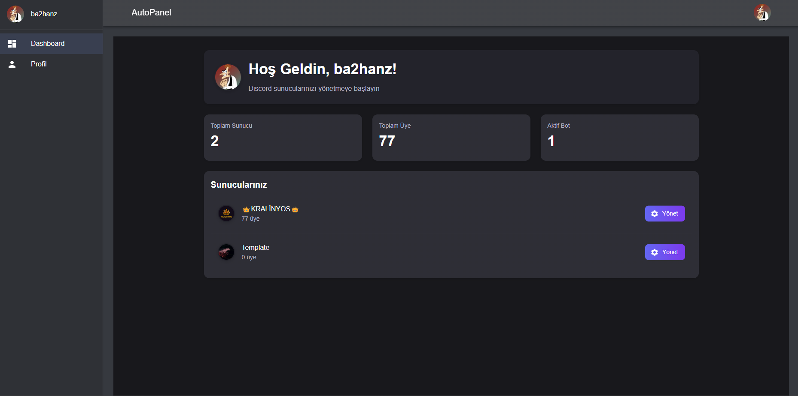

# 🧠 AutoPanel Discord Bot

AutoPanel, Discord sunucularınızı kolayca yönetebilmeniz için tasarlanmış gelişmiş bir otomasyon botudur. Sunucu sahipleri ve moderatörler için çekiliş, rol yönetimi, slowmode gibi pek çok özelliği bir araya getirir.

## 🚀 Özellikler(Yenilenecek ve geliştirilecek)

- 🎉 **Çekiliş Sistemi**  
  - Süreli çekiliş başlatma  
  - Kazanan sayısı belirleme  
  - Çekilişi hemen bitirme  
  - Çekilişi iptal etme  
  - Geçmiş çekilişlere göz atma  

- 🕓 **Slow Mode Ayarlama**  
  - Kanal bazlı slowmode limiti belirleme  

- 🏷️ **Rol Verme**  
  - Komutla kullanıcıya rol atama  

- 📦 **Web Panel Entegrasyonu (Hazırlanıyor)**  
  - Web panel üzerinden botu yönetme (giriş, sunucu listesi, çekiliş kontrolü vb.)

## 📸 Ekran Görüntüsü

> Açıklama: Koyu temalı, modern bir tanıtım sayfası ve şık bir logo ile birlikte gelir.

## ⚙️ Kurulum

### 1. Reposu klonlayın

\`\`\`bash
git clone https://github.com/ba2hanz/autopanel-dc.git
cd autopanel-dc
\`\`\`

### 2. Gerekli modülleri yükleyin

\`\`\`bash
npm install
\`\`\`

### 3. \`.env\` dosyasını oluşturun

Ana dizine bir \`.env\` dosyası ekleyin ve aşağıdaki gibi doldurun:

\`\`\`env
PORT=5000
MONGODB_URI=mongodb://localhost:27017/autopanel
JWT_SECRET=your-secret-key

DISCORD_CLIENT_ID=your-client-id
DISCORD_CLIENT_SECRET=your-client-secret
DISCORD_REDIRECT_URI=http://localhost:3000/auth/callback

FRONTEND_URL=http://localhost:3000
\`\`\`

> \`JWT_SECRET\` için güçlü ve rastgele bir string kullanın. Örnek: \`node -e "console.log(require('crypto').randomBytes(64).toString('hex'))"\`

### 4. Bot tokenini \`.env\` veya config dosyanıza eklemeyi unutmayın!

## 🧪 Kullanım

Botu başlatmak için:

\`\`\`bash
node index.js
\`\`\`

## 📁 Proje Yapısı

\`\`\`
autopanel-dc/
├── commands/             # Tüm bot komutları
├── events/               # Discord event handler'ları
├── models/               # Mongoose veri modelleri
├── utils/                # Yardımcı fonksiyonlar
├── web/                  # Web panel (HTML + backend)
├── assets/               # Logo ve tanıtım görselleri
├── .env.example          # Örnek .env dosyası
└── README.md
\`\`\`

## 🛠️ Katkı Sağlama

Katkı sağlamak istersen:

1. Bu repoyu forkla
2. Yeni bir branch oluştur (\`feature/yenilik\`)
3. Geliştirmeni yap
4. Pull request gönder 🎉

## 📜 Lisans

MIT © [ba2hanz](https://github.com/ba2hanz)
